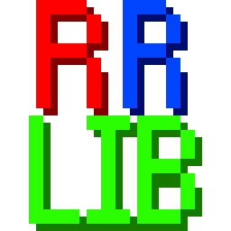
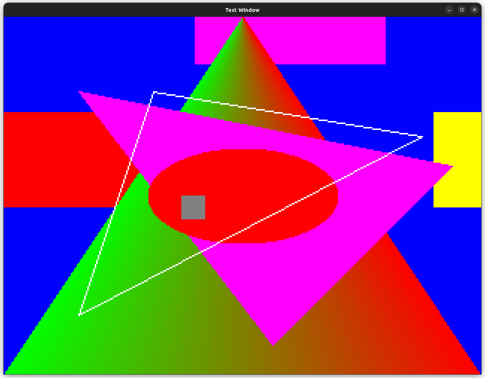

# Retro Raster Lib
 
-- Current Version 0.0.4-alpha --
---
### Features
- Pixel based graphics
- 2D rasterizing

- Image loading
- Multiple windows
- Keyboard support
- Mouse support
- Joystick support

### Notes
 - This library is not done yet!
---

### Building
The project requires c++20 as well as
- [SDL2 >= 2.26.2](https://github.com/libsdl-org/SDL/releases/)
- [SDL2_image >= 2.6.0](https://github.com/libsdl-org/SDL_image/releases)

#### Linux
This project is built with g++ 11.3.0 
Build and install SDL2 and SDL2_Image 
Build the project with 
`
make all
`

#### Windows
Download the SDL2-VC files 
Place the include and lib folders in the SDL2 and SDL2_Image directories located in RetroRasterLib/SDL2 
Build with the RetroRasterLib Visual Studio Solution file
